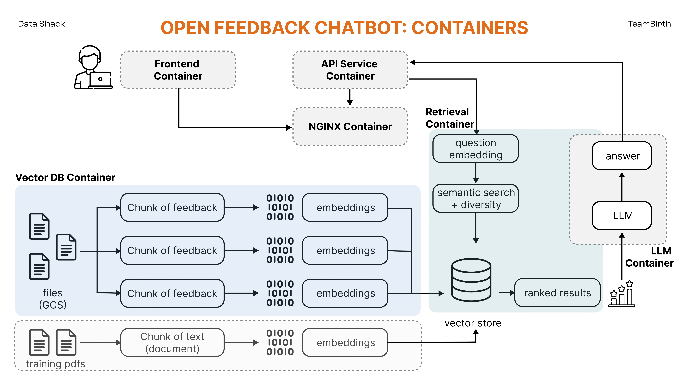

Dashbirth - [Data Shack 2024](https://sites.google.com/view/datashack-harvard-polimi/data-shack-2024)
==============================

**Team Members**
Yuqin (Bailey) Bai, Luca Bottani, Sara Merengo, and Li Yao

**[Project Objectives](https://sites.google.com/view/datashack-harvard-polimi/data-shack-2024#h.ejfv8fmb4s2f)**
This project proposes to utilize advanced language models to analyze postpartum surveys completed by thousands of mothers. The aim is to derive actionable insights that can further enhance the [TeamBirth](https://www.ariadnelabs.org/delivery-decisions-initiative/teambirth/) program, particularly focusing on reducing maternal mortality rates and addressing mistreatment and disparities in maternal health.
* To deploy language models in summarizing and analyzing postpartum surveys from mothers who have participated in the TeamBirth program.
* To identify areas where TeamBirth can be refined to further reduce maternal mortality and mistreatment.
* To develop targeted interventions based on the insights gleaned from the survey analysis.

## Patient Data Privacy
Following the Ethical Principles & Guidelines for Research Involving Human Subjects, maintaining the confidentiality of patient data is paramount. In our efforts to utilize advanced language models for analyzing surveys, we are committed to ensuring that no patient-related data is exposed to external APIs, including ChatGPT. We understand the risks associated with data privacy and have implemented robust solutions to safeguard information.

To address different data storage and usage needs while ensuring data privacy, we offer the following solutions:

### Local Hosting
For a straightforward setup, we provide the option to locally host the dashboard. This setup includes all modules except for the open feedback and chatbot features.

It is highly suggested to store any patient-related data in a dedicated folder outside the Git repository. This practice prevents the accidental upload of confidential data to version control systems where it could be exposed to unauthorized access.

**Setup Instructions**
1. Ensure you have Docker installed on your system.
2. Have your data stored securely as suggested, outside of your project’s Git repository.
3. Follow the instructions in our [Frontend Simple Container Setup](#frontend-simple-container) to deploy locally.

### Advanced Deployment with Google Cloud Platform
For enhanced security and control, we recommend deploying our solution using the Google Cloud Platform (GCP). This approach utilizes Google Cloud's robust security measures, including isolated storage and controlled access.

Why Choose Google Cloud Storage (GCS) and GCP Virtual Machine (VM)?
* **GCS buckets** offer advanced security features that make it a preferable choice over options like Google Drive. GCS provides fine-grained access controls and is designed for high durability and availability.
* GCP **VM instances** provide a secure environment for hosting our custom language models, eliminating the risks associated with using external APIs.


## Proposed Solution
An interactive dashboard website that TeamBirth can use in order to visualize the data and share it to the hospitals.

### Prerequisites
* Have Docker installed

### Frontend Simple Container
* Build & run container by running the commands with the absolute path to your data folder
    ```
    cd src/frontend_simple

    docker build -t frontend_simple -f Dockerfile .
    docker run -d -p 5001:5000 -v </absolute/path/to/your/data>:/data frontend_simple
    ```
- Go to page `http://localhost:5001/`


---


### Vector Database Container

### Retrival Container

### Large Language Model Container
This container is configured to serve a Large Language Model (LLM), specifically Llama2-7B-chat, on a Google Cloud Platform (GCP) Virtual Machine (VM). We opted to deploy the LLM in a cloud environment to address data privacy concerns and because hosting it locally is challenging. The model requires 15GB of memory and a T4 GPU to function optimally. Below, you will find instructions on how to set up a similar server on your own.

1. Build Docker Image
Assuming you have a Dockerfile in your project directory, navigate to that directory in your terminal and run the following command to build the Docker image:
* docker build -t <image_name> .
Replace <image_name> with the desired name for your Docker image.

2. Tag the Docker Image
After the build is complete, tag your Docker image with the Google Cloud Registry path:
* docker tag <image_name> gcr.io/<project_id>/<image_name>
Replace <project_id> with your Google Cloud project ID and <image_name> with the same name you used in the previous step.

3. Authenticate Docker to GCR
Authenticate Docker to the Google Cloud Registry using the following command:
* gcloud auth configure-docker

4. Push Docker Image to GCR
Push the Docker image to the Google Cloud Registry:
* docker push gcr.io/<project_id>/<image_name>

5. Create a Google Cloud VM
Navigate to the Google Cloud Console and create a new Virtual Machine instance. Make sure to select the appropriate region, machine type, and other settings according to your requirements.
e.g. Region: us-east1, Zone: us-east1-c, GPU type: NVIDIA T4, Machine Type: n1-standard-4 (4 vCPU, 2 core, 15 GB memory), VM provisioning model: Spot (Save you some money but loss some stability)

6. Install Docker on the VM
SSH into your VM and install Docker:
* sudo apt-get update
* sudo apt-get install docker.io

7. Pull Docker Image from GCR
Pull the Docker image from the Google Cloud Registry to your VM:
* docker pull gcr.io/<project_id>/<image_name>
Now, you need to add other packages and drivers to communicate with the GPUs.

8. Install GPU drivers on VM
Follow the intstruction in the Google Cloud website: https://cloud.google.com/compute/docs/gpus/install-drivers-gpu to install GPU drivers on the VM. You cannot use your GPUs without the driver. Verify the GPU driver install by this command:
* sudo nvidia-smi

9. Download the NVIDIA CUDA Toolkit
Follow the instruction in the NVIDIA website to download the NVIDIA CUDA Toolkit (section 2.7) https://docs.nvidia.com/cuda/cuda-installation-guide-linux/


10. Run Docker Container on VM
Finally, run the Docker container on your VM:
* docker run -d -p <host_port>:<container_port> <image_name>
Replace <host_port> and <container_port> with the ports you want to expose on the host and container, respectively.


### API Service Container


## Docker Cleanup
Make sure we do not have any running containers and clear up an unused images.
* Run `docker container ls`
* Stop any container that is running
* Run `docker system prune`
* Run `docker image ls`